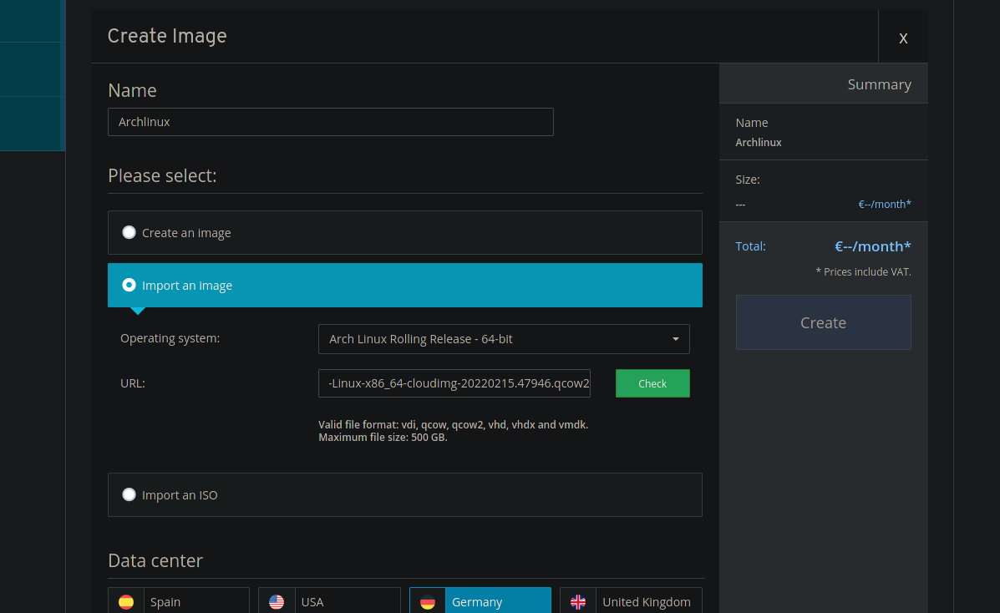

# Steps to initialize the VPS
This webisite is hosted on a server from [IONOS](https://ionos.de). The following are steps to initialize a VPS with this specific provider for this specific website.

## (1) Default Gateway IP

To get the defaut gateway IP you first have to install an image provided by IONOS (ex. Debain, CentOS). After that, connect to the VPS over ssh and execute the following command:


## (2) Add Arch Image

To add the Arch Image, go to *Infrastructure* >> *Images*, on the cloudpanel of the VPS, and press *Create*. Choose a name and select *Import an image*.



You can find


```
#cloud-config
resize_rootfs: True
users:
  - name: arch
    gecos: Server Admin
    sudo: ALL=(ALL) NOPASSWD:ALL
    groups: users, admin
    ssh_import_id: None
    lock_passwd: true
    ssh_authorized_keys:
      - ssh-rsa AAAAB3NzaC1yc2EAAAADAQABAAACAQC6+N4YJod2IMyNex6OmbeOhstEgaehiVoAgVIut5fFsQTfxfHEUjQI1JJNnguwJjApOenHmMfcIVJg5UF8Ct+IwmJ0n7cBXoQmI9U6UikU726j0iKCKVcQR/Ir6d//cP6DIbBTrYOeBUTYabwD+ZPXcaCmTl6ZkIk+elBoMsH6GGMChexpBWJ45sRFvQQOKNBrr55MZHAgoxbIcMmggGf1lN9PcFRePqrVcpfM79EXjHX9bXz6fLnlrYLS26dr5IzpzHkNsKteqoXR4Wr8dUBXi8zR9TYCjNe6Hsz/S7EgzneFDcm4SuC0tAXBKHVlNhMTqZyF2ql/CylSBtOeXY9+wjd3gl+BctxX+3lwtyjM7Tq8q61vyre8TKU4+WcX7RQrxeXPmF/LHta0ZBVWnudeJDdrX8MInNXkYm201q+eMFyoH7aDNeMVk7b2YzTdLRA5UCBtnXwdqejkiXKJhM8Ve633RNogxK9op4JiVwmqus3HMACqhILWTGvsuS70aygCV3RKWoqhV7mpZY5UBbZhOrUFlaviq9IuRYNY4NGkFTvCVPqFoS7rBPn320cOQFFtWh1ZmHG295hxFaX1MiK5l0/ux8Z6kcMYo+o38MjsGdHmZXb65OAr+8ZWVtWJTYlfl81AVGTCcyMjRnoqCSwJdKIZQDiYvyZRnEvrq/ZgXw== jannik@Axolotl
```